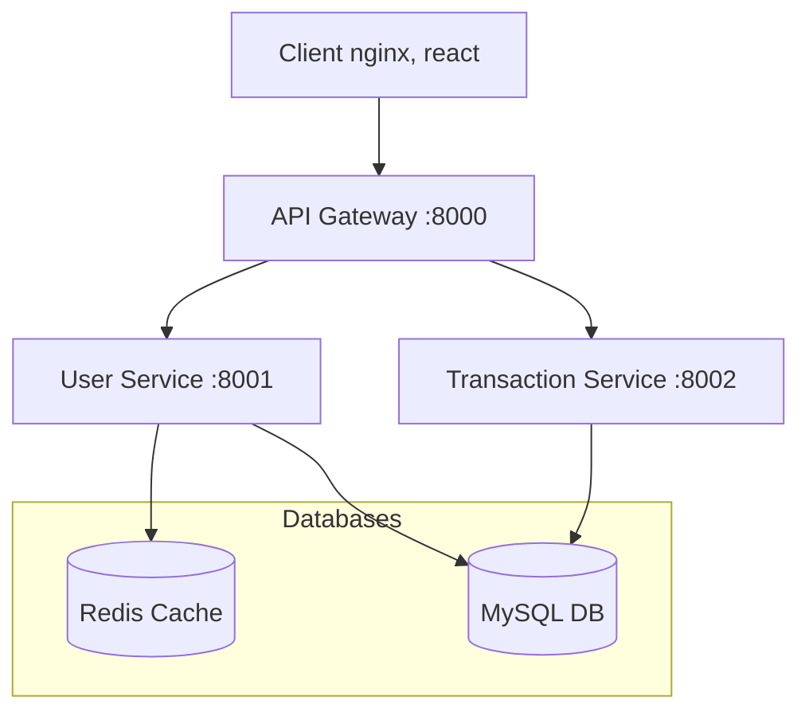

# Finance Management Microservices

클라우드 네이티브 과제로 제출하기 위한,
클라우드 네이티브 환경에서 운영되는 가계부 마이크로서비스 애플리케이션

## BUG
 - transaction_service에 입/출금 금액을 담당하는 amount필드가 유니크로 설정되어 있어 트랙잭션에서 금액이 같을 경우 추가되지 않는 버그를 발견했습니다.
 - 제출 기간이 지나 코드는 수정하였으나, 도커 이미지를 수정하지 못했습니다
## 시스템 아키텍처


- jpa의 ddl을 사용하여 데이터 베이스를 관리
    - 따라서 docker-jpa를 사용해, 매번 데이터 베이스의 스키마를 입력하여 데이터베이스 구조를 만들지 않고, 자동으로 생성
## 통신 절차
**모든 외부 통신은 Gateway를 통해서만 가능**
1. 사용자 인증 플로우
  - 사용자가 로그인 요청을 API Gateway로 전송
  - Gateway는 요청을 User Service로 라우팅
  - User Service는 인증 후 Redis에 세션 정보 저장
  - 발급된 세션 키를 클라이언트에 반환
  - 클라이언트는 세션 키를 로컬스토리지에 저장
  - 이후 요청에서 세션 키로 인증 상태 확인
2. 트랜잭션 처리 플로우
  - 클라이언트가 거래 관련 요청을 Gateway로 전송
  - Gateway는 세션 키를 검증 (User Service와 통신)
  - 인증된 요청을 Transaction Service로 라우팅 (세션 키를 X-USER-ID 로 변환하여 헤더에 붙임)
  - Transaction Service는 MySQL DB와 통신하여 거래 정보 처리
  - 처리 결과를 클라이언트에 반환
3. 서비스 간 통신
  - API Gateway: 모든 요청의 진입점 역할 (포트: 8080)
  - User Service: 인증/인가 및 사용자 정보 관리 (포트: 8081)
  - Transaction Service: 거래 데이터 처리 및 관리 (포트: 8082)
4. 데이터 동기화
  - Redis: 세션 정보 저장
  - MySQL: 세션 외 데이터 저장소로 사용
  - 각 서비스는 (api gateway제외) 자체적으로 jpa를 사용해 데이터베이스 관리

## 기술 스택
- **client**: react / nginx
- **Framework:** Spring Boot
- **Database:** MySQL
- **Cache:** Redis
- **Container:** Docker
- **API Gateway:** Spring Cloud Gateway
- **Documentation:** Swagger/OpenAPI
- **Build Tool:** Gradle/Maven

## 시작하기

### 사전 요구사항
- Docker
- Docker Compose
- JDK 17+
- Maven 또는 Gradle

### 실행 방법

1. Docker Hub에서 이미지 가져오기
```bash
docker-compose pull
```
**docker-compose 파일** 
```yml
# docker-compose.yml
version: '3.8'

services:
  nginx:
    image: hyeonwch/cloud-native-final:nginx
    ports:
      - "80:80"
    depends_on:
      - api-gateway
    networks:
      - finance-network

  api-gateway:
    image: hyeonwch/cloud-native-final:api-gateway
    ports:
      - "8080:8080"
    environment:
      - SPRING_PROFILES_ACTIVE=docker
      - TRANSACTION_SERVICE_URL=http://transaction-service:8081
      - USER_SERVICE_URL=http://user-service:8082
    depends_on:
      - transaction-service
      - user-service
    networks:
      - finance-network

  mysql:
    image: hyeonwch/cloud-native-final:mysql-8.0
    ports:
      - "3306:3306"
    environment:
      - MYSQL_DATABASE=financial_management
      - MYSQL_ROOT_PASSWORD=root
      - MYSQL_USER=finance_admin
      - MYSQL_PASSWORD=123456
      - MYSQL_ROOT_HOST=%
    command:
      - --character-set-server=utf8mb4
      - --collation-server=utf8mb4_unicode_ci
      - --skip-character-set-client-handshake
    volumes:
      - mysql_data:/var/lib/mysql
    networks:
      - finance-network
    healthcheck:
      test: ["CMD", "mysqladmin", "ping", "-h", "localhost", "-u", "root", "-proot"]
      interval: 10s
      timeout: 5s
      retries: 5

  redis:
    image: hyeonwch/cloud-native-final:redis-7-alpine
    ports:
      - "6379:6379"
    volumes:
      - redis_data:/data
    networks:
      - finance-network
    healthcheck:
      test: ["CMD", "redis-cli", "ping"]
      interval: 10s
      timeout: 5s
      retries: 5

  transaction-service:
    image: hyeonwch/cloud-native-final:transaction-service
    ports:
      - "8082:8082"
    environment:
      - SPRING_PROFILES_ACTIVE=docker
      - SPRING_DATASOURCE_URL=jdbc:mysql://mysql:3306/financial_management?useSSL=false&allowPublicKeyRetrieval=true&serverTimezone=UTC&characterEncoding=UTF-8
      - SPRING_DATASOURCE_USERNAME=finance_admin
      - SPRING_DATASOURCE_PASSWORD=123456
      - SPRING_JPA_PROPERTIES_HIBERNATE_DIALECT=org.hibernate.dialect.MySQL8Dialect
      - SPRING_JPA_HIBERNATE_DDL_AUTO=update
    depends_on:
      mysql:
        condition: service_healthy
    networks:
      - finance-network

  user-service:
    image: hyeonwch/cloud-native-final:user-service
    ports:
      - "8081:8081"
    environment:
      - SPRING_PROFILES_ACTIVE=docker
      - SPRING_DATASOURCE_URL=jdbc:mysql://mysql:3306/financial_management?useSSL=false&allowPublicKeyRetrieval=true&serverTimezone=UTC&characterEncoding=UTF-8
      - SPRING_DATASOURCE_USERNAME=finance_admin
      - SPRING_DATASOURCE_PASSWORD=123456
      - SPRING_JPA_PROPERTIES_HIBERNATE_DIALECT=org.hibernate.dialect.MySQL8Dialect
      - SPRING_JPA_HIBERNATE_DDL_AUTO=update
      - SPRING_REDIS_HOST=redis
      - SPRING_REDIS_PORT=6379
    depends_on:
      mysql:
        condition: service_healthy
      redis:
        condition: service_healthy
    networks:
      - finance-network

volumes:
  mysql_data:
  redis_data:

networks:
  finance-network:
    driver: bridge
```
```yml
# docker-compose.yml - apple silicon mac 버전, arm64가 필요함
version: '3.8'
services:
  nginx:
    image: hyeonwch/cloud-native-final:nginx
    platform: linux/amd64  # 플랫폼 지정
    ports:
      - "80:80"
    depends_on:
      - api-gateway
    networks:
      - finance-network

  api-gateway:
    image: hyeonwch/cloud-native-final:api-gateway
    platform: linux/amd64  # 플랫폼 지정
    ports:
      - "8080:8080"
    environment:
      - SPRING_PROFILES_ACTIVE=docker
      - TRANSACTION_SERVICE_URL=http://transaction-service:8081
      - USER_SERVICE_URL=http://user-service:8082
    depends_on:
      - transaction-service
      - user-service
    networks:
      - finance-network

  mysql:
    image: mysql:8.0  # 공식 이미지 사용
    platform: linux/amd64  # 플랫폼 지정
    ports:
      - "3306:3306"
    environment:
      - MYSQL_DATABASE=financial_management
      - MYSQL_ROOT_PASSWORD=root
      - MYSQL_USER=finance_admin
      - MYSQL_PASSWORD=123456
      - MYSQL_ROOT_HOST=%
    command:
      - --character-set-server=utf8mb4
      - --collation-server=utf8mb4_unicode_ci
      - --skip-character-set-client-handshake
    volumes:
      - mysql_data:/var/lib/mysql
    networks:
      - finance-network
    healthcheck:
      test: ["CMD", "mysqladmin", "ping", "-h", "localhost", "-u", "root", "-proot"]
      interval: 10s
      timeout: 5s
      retries: 5

  redis:
    image: redis:7-alpine  # 공식 이미지 사용
    platform: linux/amd64  # 플랫폼 지정
    ports:
      - "6379:6379"
    volumes:
      - redis_data:/data
    networks:
      - finance-network
    healthcheck:
      test: ["CMD", "redis-cli", "ping"]
      interval: 10s
      timeout: 5s
      retries: 5

  transaction-service:
    image: hyeonwch/cloud-native-final:transaction-service
    platform: linux/amd64  # 플랫폼 지정
    ports:
      - "8082:8082"
    environment:
      - SPRING_PROFILES_ACTIVE=docker
      - SPRING_DATASOURCE_URL=jdbc:mysql://mysql:3306/financial_management?useSSL=false&allowPublicKeyRetrieval=true&serverTimezone=UTC&characterEncoding=UTF-8
      - SPRING_DATASOURCE_USERNAME=finance_admin
      - SPRING_DATASOURCE_PASSWORD=123456
      - SPRING_JPA_PROPERTIES_HIBERNATE_DIALECT=org.hibernate.dialect.MySQL8Dialect
      - SPRING_JPA_HIBERNATE_DDL_AUTO=update
    depends_on:
      mysql:
        condition: service_healthy
    networks:
      - finance-network

  user-service:
    image: hyeonwch/cloud-native-final:user-service
    platform: linux/amd64  # 플랫폼 지정
    ports:
      - "8081:8081"
    environment:
      - SPRING_PROFILES_ACTIVE=docker
      - SPRING_DATASOURCE_URL=jdbc:mysql://mysql:3306/financial_management?useSSL=false&allowPublicKeyRetrieval=true&serverTimezone=UTC&characterEncoding=UTF-8
      - SPRING_DATASOURCE_USERNAME=finance_admin
      - SPRING_DATASOURCE_PASSWORD=123456
      - SPRING_JPA_PROPERTIES_HIBERNATE_DIALECT=org.hibernate.dialect.MySQL8Dialect
      - SPRING_JPA_HIBERNATE_DDL_AUTO=update
      - SPRING_REDIS_HOST=redis
      - SPRING_REDIS_PORT=6379
    depends_on:
      mysql:
        condition: service_healthy
      redis:
        condition: service_healthy
    networks:
      - finance-network

volumes:
  mysql_data:
  redis_data:

networks:
  finance-network:
    driver: bridge
```

2. 서비스 실행
```bash
# 서비스 실행
docker-compose up -d

# 실행 상태 확인
docker-compose ps

# 실행 종료
docker-compose down

# 볼륨 포함하여 완전히 제거
docker-compose down -v
```

3. 도커 컨테이너 실행
```bash
docker-compose up -d
```
4. 서비스 접속
- http://localhost

## 도메인 설명
### API Gateway (:8000)
- 라우팅 설정
- 인증/인가 필터
- 로드 밸런싱

### User Service (회원 도메인:8001)
- 사용자 관리
- 인증/인가
- 프로필 관리

### Transaction Service (거래 도메인:8002)
- 수입 관리
- 지출 관리
- 거래 내역 기록
- 카테고리 관리

## 데이터베이스 구성

### MySQL
- Database: finance_db
- 포트: 3306


### Redis
- 세션 관리 및 캐싱
- 포트: 6379

## 실행 화면
**초기 화면**

**회원 가입**

**로그인 후**

**카테고리 추가**

**입/출금 내역 추가**

**입/출금 내역 추가 후 화면**


**입/출금 필터링**


**날짜 기준 필터링**


