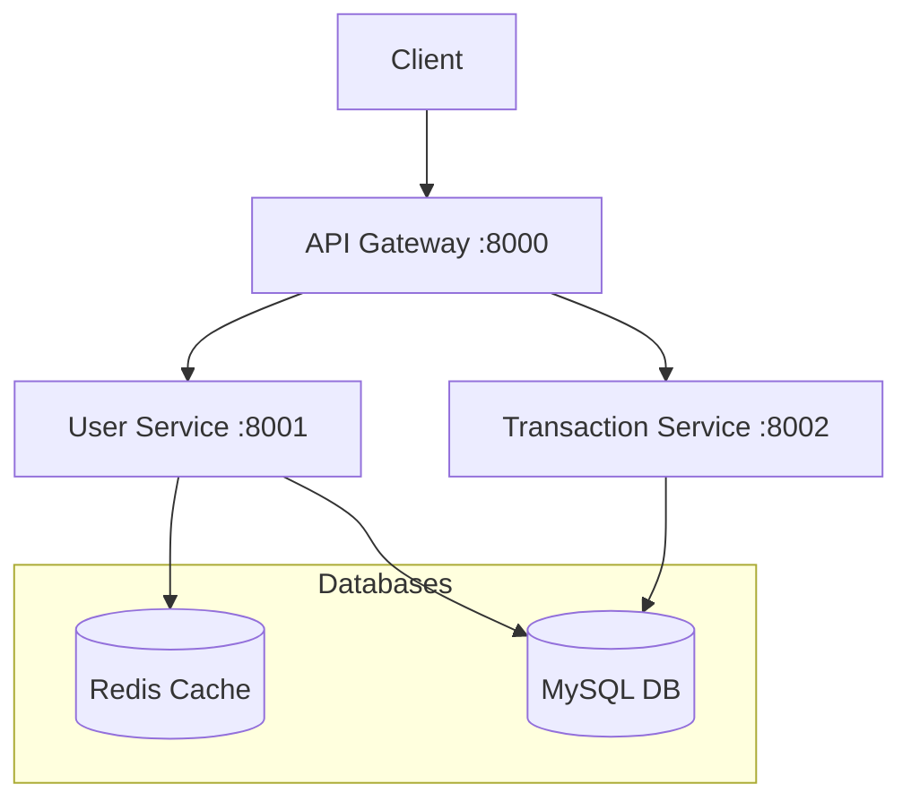

# Finance Management Microservices

클라우드 네이티브 과제로 제출하기 위한,
클라우드 네이티브 환경에서 운영되는 가계부 마이크로서비스 애플리케이션

## 시스템 아키텍처


- jpa의 ddl을 사용하여 데이터 베이스를 관리
    - 따라서 docker-jpa를 사용해, 매번 데이터 베이스의 스키마를 입력하여 데이터베이스 구조를 만들지 않고, 자동으로 생성
## 통신 절차
**모든 외부 통신은 Gateway를 통해서만 가능**
1. 사용자 인증 플로우
   1.1. 사용자가 로그인 요청을 API Gateway로 전송
   1.2. Gateway는 요청을 User Service로 라우팅
   1.3. User Service는 인증 후 Redis에 세션 정보 저장
   1.4. 발급된 세션 키를 클라이언트에 반환
   1.5. 클라이언트는 세션 키를 로컬스토리지에 저장
   1.5. 이후 요청에서 세션 키로 인증 상태 확인
2. 트랜잭션 처리 플로우
   2.1. 클라이언트가 거래 관련 요청을 Gateway로 전송
   2.2. Gateway는 세션 키를 검증 (User Service와 통신)
   2.3. 인증된 요청을 Transaction Service로 라우팅 (세션 키를 X-USER-ID 로 변환하여 헤더에 붙임)
   2.4. Transaction Service는 MySQL DB와 통신하여 거래 정보 처리
   2.5 처리 결과를 클라이언트에 반환
3. 서비스 간 통신
   3.1. API Gateway: 모든 요청의 진입점 역할 (포트: 8080)
   3.2. User Service: 인증/인가 및 사용자 정보 관리 (포트: 8081)
   3.3. Transaction Service: 거래 데이터 처리 및 관리 (포트: 8082)
4. 데이터 동기화
   4.1. Redis: 세션 정보 저장
   4.2. MySQL: 세션 외 데이터 저장소로 사용
   4.3. 각 서비스는 (api gateway제외) 자체적으로 jpa를 사용해 데이터베이스 관리

## 기술 스택

- **Framework:** Spring Boot
- **Database:** MySQL
- **Cache:** Redis
- **Container:** Docker
- **API Gateway:** Spring Cloud Gateway
- **Documentation:** Swagger/OpenAPI
- **Build Tool:** Gradle/Maven

## 시작하기

### 사전 요구사항
- Docker
- Docker Compose
- JDK 17+
- Maven 또는 Gradle

### 실행 방법

1. 프로젝트 클론
```bash
git clone https://github.com/yourusername/finance-microservices.git
```

2. 서비스 빌드
```bash
./gradlew clean build
```

3. 도커 컨테이너 실행
```bash
docker-compose up -d
```

4. 서비스 접속
- API Gateway: http://localhost:8000
- Swagger UI: http://localhost:8000/swagger-ui.html

## 프로젝트 구조
```
project-root/
├── api-gateway/
├── user-service/
├── transaction-service/
├── analytics-service/
├── notification-service/
├── docker-compose.yml
└── README.md
```

## 도메인 설명
### API Gateway (:8000)
- 라우팅 설정
- 인증/인가 필터
- 로드 밸런싱
```
├── api-gateway/
│   ├── src/main/java/com/finance/gateway/
│   │   ├── GatewayApplication.java
│   │   └── config/
│   │       └── RouteConfig.java
│   └── Dockerfile
```
### User Service (회원 도메인:8001)
- 사용자 관리
- 인증/인가
- 프로필 관리
- 알림 설정 관리

```
user-service/
├── src/main/java/com/finance/user/
│   ├── controller/
│   │   ├── UserController.java
│   │   └── AuthController.java
│   ├── service/
│   │   ├── UserService.java
│   │   └── AuthService.java
│   ├── repository/
│   │   └── UserRepository.java
│   ├── domain/
│   │   ├── User.java
│   │   └── UserPreference.java
│   └── dto/
│       ├── UserDTO.java
│       └── AuthDTO.java
```

### Transaction Service (거래 도메인:8002)

- 수입 관리
- 지출 관리
- 거래 내역 기록
- 카테고리 관리
```
Transaction Service
├── src/main/java/com/finance/transaction/
│   ├── controller/
│   │   ├── IncomeController.java
│   │   └── ExpenseController.java
│   ├── service/
│   │   ├── TransactionService.java
│   │   └── CategoryService.java
│   ├── repository/
│   │   ├── TransactionRepository.java
│   │   └── CategoryRepository.java
│   ├── domain/
│   │   ├── Transaction.java
│   │   └── Category.java
│   └── dto/
│       ├── TransactionDTO.java
│       └── CategoryDTO.java
```
### Analytics Service (분석 도메인:8003)

- 월별 지출 분석
- 카테고리별 분석
- 예산 대비 지출 분석
- 지출 패턴 분석
```
analytics-service/
├── src/main/java/com/finance/analytics/
│   ├── controller/
│   │   ├── BudgetAnalysisController.java
│   │   └── SpendingAnalysisController.java
│   ├── service/
│   │   ├── AnalyticsService.java
│   │   └── ReportService.java
│   ├── repository/
│   │   └── AnalyticsRepository.java
│   ├── domain/
│   │   ├── BudgetAnalysis.java
│   │   └── SpendingPattern.java
│   └── dto/
│       ├── AnalyticsDTO.java
│       └── ReportDTO.java
```
### Notification Service (알림 도메인:8004)

- 예산 초과 알림
- 월간 리포트 발송
- 중요 지출 알림
- 알림 이력 관리
```
notification-service/
├── src/main/java/com/finance/notification/
│   ├── controller/
│   │   └── NotificationController.java
│   ├── service/
│   │   ├── NotificationService.java
│   │   └── EmailService.java
│   ├── repository/
│   │   └── NotificationRepository.java
│   ├── domain/
│   │   ├── Notification.java
│   │   └── NotificationPreference.java
│   └── dto/
│       └── NotificationDTO.java
```

## 데이터베이스 구성

### MySQL
- Database: finance_db
- 각 서비스별 독립적인 스키마 사용
- 포트: 3306

### Redis
- 세션 관리 및 캐싱
- 포트: 6379

## API 문서
각 서비스의 API 문서는 Swagger UI를 통해 확인할 수 있습니다:
- User Service: http://localhost:8001/swagger-ui.html
- Transaction Service: http://localhost:8002/swagger-ui.html
- Analytics Service: http://localhost:8003/swagger-ui.html
- Notification Service: http://localhost:8004/swagger-ui.html

## 제출 시에
- 1,2 번 항목은 가능하다면, 컨테이너 구성 등의 방법을 캡쳐해서 제출
- 결과만 캡쳐하고 코드는 스냥 파일로 제출하면 됨
- 도커 관련 파일은 그냥 허브에 올리면 됨
- 용량이 정 부족하다 싶으면 구글 드라이브에 올려서 링크 공유 가능
